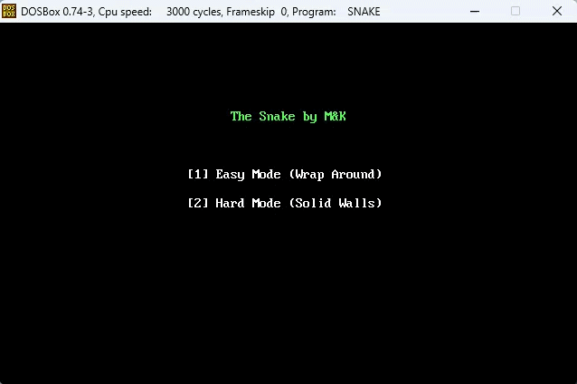

# 🐍 The Snake — x86 Assembly (emu8086)

A fully playable Snake game written in **x86 16-bit Assembly**, built for the [emu8086](https://emu8086-microprocessor-emulator.en.softonic.com/) emulator. Features two difficulty modes, real-time keyboard input, hardware LED score display, and direct VRAM rendering — no OS abstractions, just raw silicon.

---

## 📸 Preview

<div align="center">



</div>

---

## ✨ Features

- **Two Difficulty Modes**
  - 🟢 **Easy Mode** — Snake wraps around screen edges
  - 🔴 **Hard Mode** — Hitting a wall ends the game instantly
- **Direct VRAM Rendering** — Characters written straight to `0B800h` video memory segment
- **Hardware LED Score** — Score is pushed to emu8086's virtual I/O port `199` for the external LED panel
- **Self-Collision Detection** — Game over when the snake runs into its own body
- **Random Apple Spawning** — New apple position seeded from the BIOS system clock
- **Smooth Movement** — Synchronized to hardware timer ticks via BIOS `INT 1Ah`
- **Instant Restart** — Press `[1]` after a game over to return to the main menu

---

## 🎮 Controls

| Key | Action |
|-----|--------|
| `↑` Arrow | Move Up |
| `↓` Arrow | Move Down |
| `←` Arrow | Move Left |
| `→` Arrow | Move Right |
| `1` | Select Easy Mode / Restart |
| `2` | Select Hard Mode |

> Reversing direction (e.g. pressing Left while moving Right) is blocked to prevent instant self-collision.

---

## 🚀 Getting Started

### Prerequisites

- [emu8086 Emulator](https://emu8086-microprocessor-emulator.en.softonic.com/) 
- [DosBox](https://www.dosbox.com/index.php) 

### Running the Game

1. **Clone the repository**
   ```bash
   git clone https://github.com/MahmoudElshoobary/asm-8086-snake-game.git
   cd snake-asm
   ```

2. **Open in emu8086**
   - Launch emu8086
   - Go to `File → Open` and load `snake.asm`

3. **Assemble & Run**
   - Click **Compile** (or press `F5`)
   - drag the **.COM** file to the DosBox app
   - The game boots directly into in DOSBox

---

## 🏗️ Project Structure

```
snake-asm/
├── snake.asm       # Full game source code
└── README.md       # Project documentation
```

---

## 🧠 Architecture Overview

The game runs as a single `.COM`-style program using `ORG 100h`. All logic is organized into modular subroutines:

| Subroutine | Responsibility |
|---|---|
| `show_dashboard` | Renders the main menu using BIOS `INT 10h` |
| `init_game_state` | Resets all game variables and draws initial frame |
| `main_loop` | Core game loop — runs every tick |
| `ReadInput` | Non-blocking keyboard poll via `INT 16h` |
| `SaveTail` / `EraseTail` | Tracks and clears the snake's trailing segment from VRAM |
| `ShiftBody` | Cascades segment coordinates from head to tail |
| `MoveHead` | Advances head position based on current direction |
| `CheckBorders` | Handles wall wrap (Easy) or wall crash (Hard) |
| `CheckSelfCollision` | Detects head-to-body overlap |
| `CheckApple` | Detects head-to-apple overlap and triggers growth |
| `SpawnApple` | Places a new apple at a clock-seeded random position |
| `DrawHead` / `DrawApple` / `DrawFullSnake` | VRAM rendering routines |
| `CalculateOffset` | Converts `(row, col)` to a VRAM byte offset: `row×160 + col×2` |
| `WaitTick` | Busy-waits until the BIOS clock tick advances |
| `UpdateLEDScore` | Outputs current score to emu8086 hardware I/O port `199` |

### Memory Layout

```
VRAM Offset = (Row × 160) + (Col × 2)
Each cell = 2 bytes: [ASCII char] [Color attribute]
Video segment base: 0B800h
```

### Snake Representation

The snake is stored as two parallel byte arrays (`snakeRow` and `snakeCol`), each holding up to 100 segments. On every tick, segments are shifted backwards from head to tail before the head is advanced — an efficient in-place linked-list-style shift.

---

## 📊 Scoring

- Score = `snakeLength − 3` (each apple eaten = +1)
- Score is displayed in the **Game Over screen** and output live to the **emu8086 LED panel** via I/O port `199`

---

## ⚙️ Technical Details

| Property | Value |
|---|---|
| Architecture | x86 16-bit |
| Assembler | emu8086 |
| Video Mode | `INT 10h` Mode `03h` (80×25 Text) |
| Input | BIOS `INT 16h` (non-blocking poll) |
| Timer | BIOS `INT 1Ah` tick counter |
| Max Snake Length | 100 segments |
| Screen Dimensions | 80 columns × 25 rows |

---

## 👥 Authors
  **Mahmoud El Shoobary**
  
  **Kamel Mohamed**
  
  — Built as an exploration of low-level systems programming and direct hardware interaction in x86 Assembly.

---

## 📄 License

This project is open source and available under the [MIT License](https://en.wikipedia.org/wiki/MIT_License).
